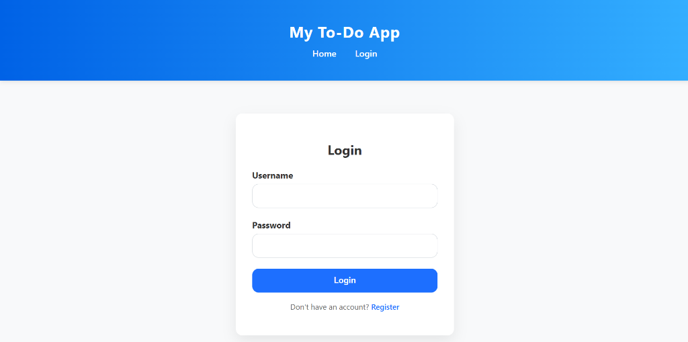
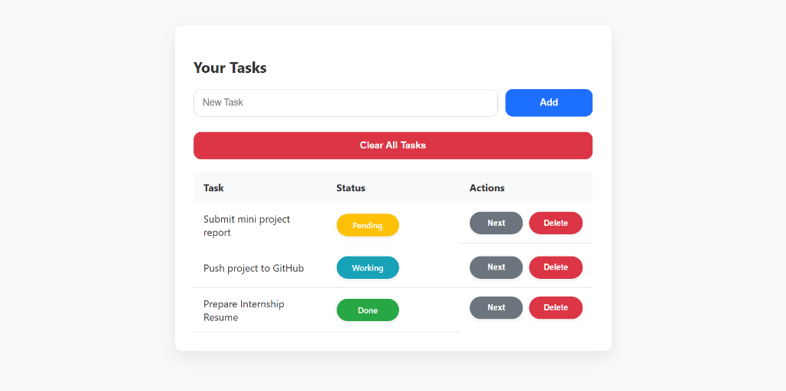

# 📝 Premium Flask To-Do Web Application

A modern, fast, and secure To-Do management web application built using **Flask**, **SQLAlchemy**, and **SQLite**. It offers complete task lifecycle management with a clean user experience powered by **dynamic AJAX interactions** (no page reloads) and client-side notifications.

---


<p align="center">
  <a href="https://opensource.org/licenses/MIT">
    
  </a>
  <a href="https://www.python.org/">
    
  </a>
  <a href="https://flask.palletsprojects.com/">
    
  </a>
</p>

---

## 🔗 Live Demo
🚀 **Check out the live demo here:** **[Live Demo Link Placeholder]** *(e.g., https://your-app.onrender.com)*

---

## 📸 Screenshots

<p align="center">
  <b>Login Page</b><br>
  
  <br><br>
  <b>Tasks Dashboard</b><br>
  
</p>

---

## 📖 Table of Contents
- [✨ Key Features](#-key-features)
- [📸 Screenshots](#-screenshots)
- [🛠️ Tech Stack](#️-tech-stack)
- [📂 Directory Structure](#-directory-structure)
- [🔌 API & Routing Documentation](#-api--routing-documentation)
- [⚙️ Setup & Installation](#️-setup--installation)
- [🚀 Running the App](#-running-the-app)
- [💡 Future Enhancements](#-future-enhancements)
- [📝 License](#-license)

## ✨ Key Features

*   **🔒 Secure User Accounts**: Complete user registration and login flows with secure password hashing via `werkzeug.security`.
*   **🔄 3-State Task Cycle**: Custom workflow that cycles task statuses through:
    $$\text{Pending} \rightarrow \text{Working} \rightarrow \text{Done} \rightarrow \text{Pending}$$
*   **⚡ AJAX Powered UI**: Add, toggle, delete, and clear tasks seamlessly without full-page reloads.
*   **🔔 Dynamic Flash Messages**: Client-side notifications that automatically fade out after $3.5$ seconds.
*   **💾 Persistent Database**: Full SQLite integration with SQLAlchemy models (`User` and `Task`) enforcing proper foreign-key relationships.

---

## 🛠️ Tech Stack

| Component | Technology | Description |
| :--- | :--- | :--- |
| **Backend Framework** | [Flask](https://flask.palletsprojects.com/) | Micro web framework for Python. |
| **Database ORM** | [Flask-SQLAlchemy](https://flask-sqlalchemy.palletsprojects.com/) | Python SQL toolkit and Object Relational Mapper. |
| **Database** | [SQLite](https://www.sqlite.org/) | Lightweight disk-based relational database. |
| **Security** | [Werkzeug](https://werkzeug.palletsprojects.com/) | Secure password hashing (`scrypt` / `pbkdf2:sha256`). |
| **Frontend** | HTML5, CSS3, ES6 JavaScript | Native styles and modern fetch APIs. |

---

## 📂 Directory Structure

Here is the organization of the codebase:

```text
my-to-do-app/
├── app/
│   ├── routes/
│   │   ├── auth.py          # User authentication routes (Login/Register/Logout)
│   │   └── task.py          # Core task routes (Create/Toggle/Delete/Clear)
│   ├── static/
│   │   ├── css/
│   │   │   └── styles.css   # Custom CSS stylesheet
│   │   └── js/
│   │       └── script.js    # Fetch API calls & dynamic DOM modifications
│   ├── templates/
│   │   ├── base.html        # Main HTML skeleton containing navigation and flashes
│   │   ├── login.html       # Login form template
│   │   ├── register.html    # Registration form template
│   │   └── tasks.html       # Task dashboard template
│   ├── __init__.py          # Flask app creator & extension initializer
│   └── models.py            # SQLite Database tables (User & Task models)
├── instance/
│   └── todo.db              # Local SQLite database file (Auto-generated)
├── run.py                   # App entrypoint (run locally)
├── .gitignore               # Ignored environments & system files
├── LICENSE                  # MIT License details
└── README.md                # Project documentation
```

---

## 🔌 API & Routing Documentation

The app is built on modular Flask Blueprints:

### Authentication Blueprint (`auth`)
| Route | Method | Access | Description |
| :--- | :--- | :--- | :--- |
| `/register` | `GET` / `POST` | Public | Registers a new user. Performs input validation. |
| `/login` | `GET` / `POST` | Public | Auths user and starts session. |
| `/logout` | `GET` | Session | Clears session cookies. |

### Tasks Blueprint (`tasks`)
| Route | Method | Access | Description |
| :--- | :--- | :--- | :--- |
| `/` | `GET` | Private | Renders dashboard displaying all tasks for the logged-in user. |
| `/add` | `POST` | Private | Adds a new task. Supports AJAX/JSON returns. |
| `/toggle/<task_id>` | `POST` | Private | Cycles task status through `Pending`, `Working`, and `Done`. |
| `/delete/<task_id>` | `POST` | Private | Deletes a task. Returns JSON for instant fade/remove. |
| `/clear` | `POST` | Private | Deletes all tasks belonging to the current user. |

---

## ⚙️ Setup & Installation

Follow these steps to run the application locally on your machine:

### Prerequisites
Make sure you have **Python 3.8+** installed.

### 1. Clone the Project
```bash
git clone https://github.com/AetherCore4/my-to-do-app.git
cd my-to-do-app
```

### 2. Create and Activate a Virtual Environment
* **Windows (PowerShell/CMD):**
  ```powershell
  python -m venv venv
  .\venv\Scripts\activate
  ```
* **macOS / Linux:**
  ```bash
  python3 -m venv venv
  source venv/bin/activate
  ```

### 3. Install Required Dependencies
Install the required packages directly using `pip`:
```bash
pip install flask flask-sqlalchemy
```

---

## 🚀 Running the App

After activating your virtual environment, launch the development server:

```bash
python run.py
```

* **Local Server URL**: `http://127.0.0.1:5000/`
* **Debug Mode**: Enabled by default in `run.py`.

The SQLite database will be initialized automatically in the `instance/` folder on first run.

---

## 💡 Future Enhancements
- [ ] Add categories/folders for organizing tasks.
- [ ] Include task due dates with calendar integration.
- [ ] Add priority levels (Low, Medium, High).
- [ ] Show a task completion progress percentage bar.
- [ ] Implement a toggle for Dark/Light mode theme.

---

## 📝 License
This project is licensed under the **MIT License** - see the [LICENSE](LICENSE) file for details.
